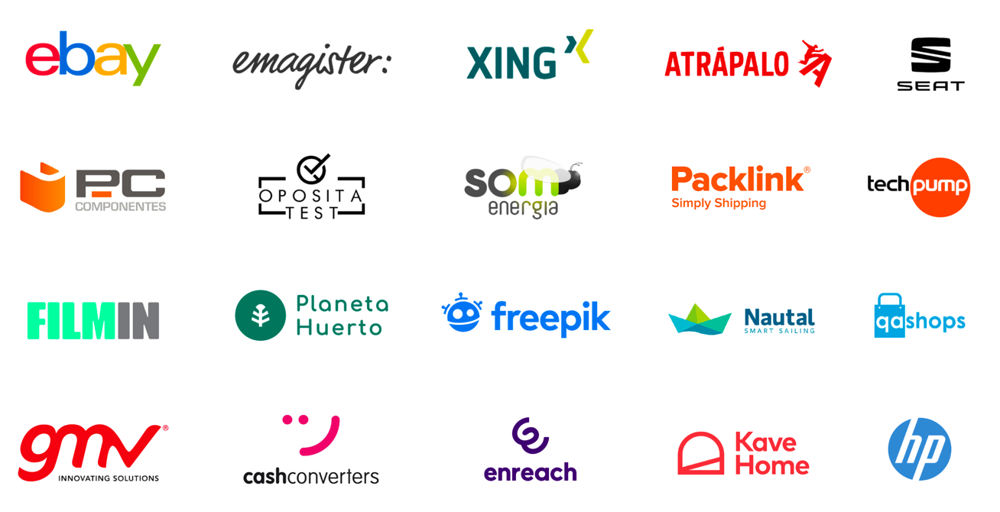

# ❤️ Why, How, and What

> **I have a mission, teams that excel.** I help tech teams become their best version.
>
> I connect team, leadership, and customers's hearts, brains, and guts to maximize impact (customer value, delivery, speed, and quality) by reducing waste and use the right technology for the company moment.
> 
> I do that by running consultancy, writing books, organizing conferences, developing open-source tools, speaking at conferences, and vblogging public content.

## 💪 Consultant

## 📖 Book Author

### Domain-Driven Design in PHP (2016) 📙

Discover DDD, Architectural Styles, Tactical Design Implementations, and Bounded Context Integration with PHP 7.4 examples

[Website](https://leanpub.com/ddd-in-php) · [Amazon](https://www.amazon.es/Domain-Driven-Design-PHP-Carlos-Buenosvinos/dp/1787284948) · [Code examples](https://github.com/dddshelf) · [Goodreads](https://www.goodreads.com/book/show/26032410-domain-driven-design-in-php)

### CQRS by Example (2022) 📘

Command-Query Responsibility Segregation is an architectural style for developing applications that split the Domain Model in Read and Write operations in order to maximize semantics, performance, and scalability. What are all the benefits of CQRS? What are the drawbacks? In which cases does it worth applying it? How does it relate to Hexagonal Architecture? How do we properly implement the Write Model and Read Models? How do we keep in sync both sides? What are the following steps to move towards Event Sourcing? This book will answer all these questions and many more, guided through lots of practical examples.

[Website](https://leanpub.com/cqrs-by-example) · [Code examples](https://github.com/dddshelf/cheeper-ddd-cqrs-example) · [Goodreads](https://www.goodreads.com/book/show/54237787-cqrs-by-example)

## 🎭 Conference Organizer

### DevOps Barcelona Conference 🚠

We feel passionated and inspired by everyone in the DevOps community. From the small Open Source Projects to the Big Cloud Players. This Conference is for every SysAdmin, Ops, DevOps, Developer, Manager or Techie who wants to level up. For those teams that want to leave a dent both in their companies and in the community.

[Website](https://devops.barcelona)

### PHP Barcelona Conference 🐘

What an incredible 2018 and 2019 for the PHP community! Part of the PHP Core Team that was working for Zend left. Some of them found excellent companies and they are rocking more than ever, like Nikita at JetBrains. PHP 7.4 is about to be released, and PHP 8 has been branched. Laravel and Symfony have healthy growth. JIT is part of the imminent future, and I/O non-blocking frameworks are getting more often adopted in production.

[Website](https://php.barcelona)

## 💻 Open Source Creator

### Ansistrano 🏗

Ansistrano is an Ansible Galaxy roles to easily deploy and rollback your scripting applications written in PHP, Python, NodeJS, or Ruby.

[Website](https://ansistrano.com) · [GitHub Repository](https://github.com/ansistrano/deploy)

## 🎤 Talks

- 📺 Kit de supervivencia para CTOs y Engineering Managers @ Salmorejo Tech (to be uploaded) - May, 2022
- 📺 Giravolta, the SaaS Mobility Platform @ AWS Summit Madrid Keynote (to be uploaded) - May, 2022
- 📺 [Arquitectura para CTOs | Carlos Buenosvinos, CTO de SEAT:CODE | #CTOSummit 🤘](https://www.youtube.com/watch?v=LXYUFf6iWl4) - March, 2022
- 📺 [JUMP2DIGITAL I Ponencia Carlos Buenosvinos](https://www.youtube.com/watch?v=XWYCsvQyYE8) - December, 2021
- 📺 [Agile In The New Normal - Jornada 2 - 30/10/2020](https://www.youtube.com/watch?v=UE7M7FKoDHw&t=4162s) - October, 2020
- 📺 [PulpoCon19 - Eventos, mensajería y otras fábulas (Carlos Buenosvinos)](https://www.youtube.com/watch?v=qwPFZ9v91kw) - September, 2020
- 📺 [Techneforum 2018 - Carlos Buenosvinos - KEYNOTE - Primeros pasos liderando equipos técnicos](https://youtube.com/watch?v=riXF98iWv0E) - Novemeber, 2019
- 📺 [Road from Hexagonal Architecture to Event Sourcing by Carlos Buenosvinos Zamora](https://www.youtube.com/watch?v=7CETV74wWB8) - November, 2019
- 📺 [Deliveritis Aguda | Carlos Buenosvinos](https://www.youtube.com/watch?v=vGCowJY5QCQ) - September, 2019
- 📺 [Talking with Carlos Buenosvinos](https://www.youtube.com/watch?v=4No8F-0jA8o) - September, 2019
- 📺 [Introducción a Domain-Driven Design en Tarragona Developers (tgndevs)](https://www.youtube.com/watch?v=dDofYAOkpts) - June, 2017
- 📺 [Live Coding en Geekshubs: Refactorizando Aplicaciones PHP](https://www.youtube.com/watch?v=AKBV7J-Ydxs) - May, 2017
- 📺 ["Scrum, no eres tú, soy yo" - II Geek Developer Day - GeeksHub Academy](https://www.youtube.com/watch?v=uzRy7a98vqg) - November, 2016
- 📺 [Charla sobre Integración Continua y Continuous Delivery por Carlos Buenosvinos](https://www.youtube.com/watch?v=vS6ne_GmAZE) - December, 2015
- 📺 [Domain-Driven Design Tactical Patterns and CI at @AtrapaloEng](https://www.youtube.com/watch?v=uvKS6UCUZes) - October, 2014
- 📺 [Introducción a Titanium](https://www.youtube.com/watch?v=v1imCCPfKwY) - August, 2012
- 📺 [Introducción a Agile y Scrum](https://www.youtube.com/watch?v=Ng65pzl3RqM) - February, 2012
- 📺 [PHP profesional](https://vimeo.com/23846442) - June, 2010

## 🎙 Interviews / Podcasts

- 📺 [TTT2x16: Innovación en la movilidad urbana con Carlos Buenosvinos, CEO & CTO de SEAT:CODE](https://www.youtube.com/watch?v=mMEIPiz1hmc) - January, 2022
- 📺 [Inside the brands: SEAT:CODE, la fábrica de software | CASA SEAT](https://www.youtube.com/watch?v=NtUVEqDkbjQ) - January, 2022
- 📺 [PODCAST 🎧 I am Geek 🚀 Episodio 3 - Negocio y tecnología con Carlos Buenosvinos](https://www.youtube.com/watch?v=ohkhoACB7L8) - October, 2021
- 📺 [SEAT:CODE, el braç digital i disruptiu de SEAT](https://www.youtube.com/watch?v=wQYRGdq_akw) - October, 2021
- 📺 [Activostech: de los SMS a los hologramas](https://www.youtube.com/watch?v=wIFykfHjSmI) - September, 2021
- 🎙 [Big data, a world full of opportunities | MOVING FORWARD](https://podcasts.google.com/feed/aHR0cHM6Ly93d3cuaXZvb3guY29tL2VuL2VucG9kY2FzdC1tb3ZpbmctZm9yd2FyZF9mZ19mMTEyNDAzNTNfZmlsdHJvXzEueG1s/episode/aHR0cHM6Ly93d3cuaXZvb3guY29tLzczMTgyOTc3?sa=X&ved=0CAUQkfYCahcKEwjgnszWxOT3AhUAAAAAHQAAAAAQDA) - July 2021
- 🎙 [Carlos Buenosvinos + Diego Villuendas · SEAT Data Office // Bedrock @ LAPIPA_Studios](https://www.listennotes.com/podcasts/data-stand-up-con/carlos-buenosvinos-diego-HpqG26d5LTY/) - March, 2021
- 📺 [BBL con Carlos Buenosvinos de SEAT:CODE](https://www.youtube.com/watch?v=Nz0yZp96Kkw) - January, 2021
- 📺 [Carlos Buenosvinos CEO & CTO of SEAT:CODE shares some insights based on our experience](https://www.youtube.com/watch?v=hG_Br_ZtWHw) - March, 2021
- 📺 [¿Cómo contribuye el big data a la mejora de la seguridad vial?](https://www.youtube.com/watch?v=wA0Up6ntfW0) - March, 2021
- 📺 [Barcelona Digital Talent Day 2020 - Jornada 1](https://youtu.be/XA2nS-hbdsI?t=3121) - December, 2020
- 📺 [FROM THE PRODUCTION LINE TO A LINE OF CODE | SEAT](https://www.youtube.com/watch?v=WbRlTVOqfas) - November, 2020
- 🎙 [WR 86: Desarrollo de software con Carlos Buenosvinos](https://www.danielprimo.io/blog/desarrollo-de-software-con-carlos-buenosvinos) - May, 2019
- 📺 [#WhoWeAre at XING Barcelona: Carlos Buenosvinos, Technical Director](https://www.youtube.com/watch?v=mccOxWJKCKo) - October, 2017
- 📺 [Entrevista Carlos Buenosvinos: Director Técnico Xing / Ex-CTO Atrápalo](https://www.youtube.com/watch?v=3NDTjXnhvok) - September, 2016

## 📐 Rigor Talks

- 📺 [Rigor Talks - PHP - Introduction (Spanish)](https://www.youtube.com/watch?v=aKcmbOZV9mA) - November, 2016
- 📺 [Rigor Talks - PHP - #1 - Guard Clauses (Spanish)](https://www.youtube.com/watch?v=Ttk9fDGwjrY) - December, 2016
- 📺 [Rigor Talks - PHP - #2 - Self-Encapsulation (Spanish)](https://www.youtube.com/watch?v=4PVUiMOVl5w) - December, 2016
- 📺 [Rigor Talks - PHP - #3 - Named Constructors I (Spanish)](https://www.youtube.com/watch?v=LjEG7AR-MOg) - December, 2016
- 📺 [Rigor Talks - PHP - #4 - Named Constructors II (Spanish)](https://www.youtube.com/watch?v=RE3cAEFSsDc) - December, 2016
- 📺 [Rigor Talks - PHP - #5 - Named Constructors III (Spanish)](https://www.youtube.com/watch?v=w2CfVDtQGc0) - December, 2016
- 📺 [Rigor Talks - PHP - #6 - Named Constructors IV (Spanish)](https://www.youtube.com/watch?v=210Ed5PeK4g) - December, 2016
- 📺 [Rigor Talks - PHP - #7 - Test Class (Spanish)](https://www.youtube.com/watch?v=8UFAyC173JU) - December, 2016
- 📺 [Rigor Talks - PHP - #8 - Self-Shunt (Spanish)](https://www.youtube.com/watch?v=Ds-Iop1zB24) - December, 2016
- 📺 [Rigor Talks - PHP - #9 - Self-Shunt II (PHP7) (Spanish)](https://www.youtube.com/watch?v=gpUDgEVw9tM) - January, 2017
- 📺 [Rigor Talks - PHP - #10 - Self-Shunt III (Spanish)](https://www.youtube.com/watch?v=e35igS90MkI) - January, 2017
- 📺 [Rigor Talks - PHP - #11 - Immutability (Spanish)](https://www.youtube.com/watch?v=577bfQMI5GY) - January, 2017
- 📺 [Rigor Talks - PHP - #12 - Mutant Testing (Spanish)](https://www.youtube.com/watch?v=kUb9JyIA5Kg) - January, 2017
- 📺 [Rigor Talks - PHP - #13 - Refactor Use Case I (Spanish)](https://www.youtube.com/watch?v=-RwBRikBXYc) - January, 2017
- 📺 [Rigor Talks - PHP - #14 - Refactor Use Case II (Spanish)](https://www.youtube.com/watch?v=1W7fj-liFqE) - February, 2017
- 📺 [Rigor Talks - PHP - #15 - Refactor Use Case III (Spanish)](https://www.youtube.com/watch?v=81dDKueYDLM) - February, 2017
- 📺 [Rigor Talks - PHP - #16 - Refactor Use Case IV (Spanish)](https://www.youtube.com/watch?v=4F1YFzoT8Qc) - February, 2017
- 📺 [Rigor Talks - PHP - #17 - Refactor Use Case V (Spanish)](https://www.youtube.com/watch?v=sTqcwuPjQ-E) - February, 2017
- 📺 [Rigor Talks - PHP - #18 - Tell-Don't-Ask (Spanish)](https://www.youtube.com/watch?v=9-pBrkvk4KA) - March, 2017
- 📺 [Rigor Talks - PHP - #19 - Refactor Use Case VI (Spanish)](https://www.youtube.com/watch?v=kFJljyhOWpg) - March, 2017
- 📺 [Rigor Talks - PHP - #20 - Application Services & Command Handlers (Spanish)](https://www.youtube.com/watch?v=6dwrRVt2wVg) - March, 2017
- 📺 [Rigor Talks - PHP - #21 - Command Bus (Spanish)](https://www.youtube.com/watch?v=OIFwYYlO_Og) - April, 2017
- 📺 [Rigor Talks - PHP - #22 - Domain Events (Spanish)](https://www.youtube.com/watch?v=9pua_1Bw4yo) - May, 2017
- 📺 [Rigor Talks - PHP - #23 - Domain Events II (Spanish)](https://www.youtube.com/watch?v=dXcHRcvgcUc) - May, 2017
- 📺 [Rigor Talks - PHP - #24 - Domain Events III (Spanish)](https://www.youtube.com/watch?v=uIu139WusKU) - May, 2017
- 📺 [Rigor Talks - PHP - #25 - Persisting Domain Events (Spanish)](https://www.youtube.com/watch?v=h40hN2wfzU8) - May, 2017
- 📺 [Rigor Talks - PHP - #26 - Events REST Distribution (Spanish)](https://www.youtube.com/watch?v=p0MM2kqOI-Y) - June, 2017
- 📺 [Rigor Talks - PHP - #27 - Async Distribution of Domain Events with RabbitMQ (Spanish)](https://www.youtube.com/watch?v=dJ_CSd0TCxw) - June, 2017
- 📺 [Rigor Talks - PHP - #28 - Sending Domain Events to Elastic (Spanish)](https://www.youtube.com/watch?v=gNkBcrY4xiE) - July, 2017
- 📺 [Rigor Talks - PHP - #29 - Sending Domain Events to Elastic II (Spanish)](https://www.youtube.com/watch?v=_MvgA5P2ACQ) - July, 2017
- 📺 [Rigor Talks - PHP - #30 - Sending Domain Events to Elastic III (Spanish)](https://www.youtube.com/watch?v=mj2w2ymCpSU) - July, 2017
- 📺 [Rigor Talks - PHP - #31 - Viewing Domain Events with Kibana (Spanish)](https://www.youtube.com/watch?v=GBXKLLCU2rE) - August, 2017

## 📰 Press

- [Executive Conversations: SEAT innovates on AWS](https://aws.amazon.com/blogs/industries/executive-conversations-seat-innovates-on-aws/)
- TBC